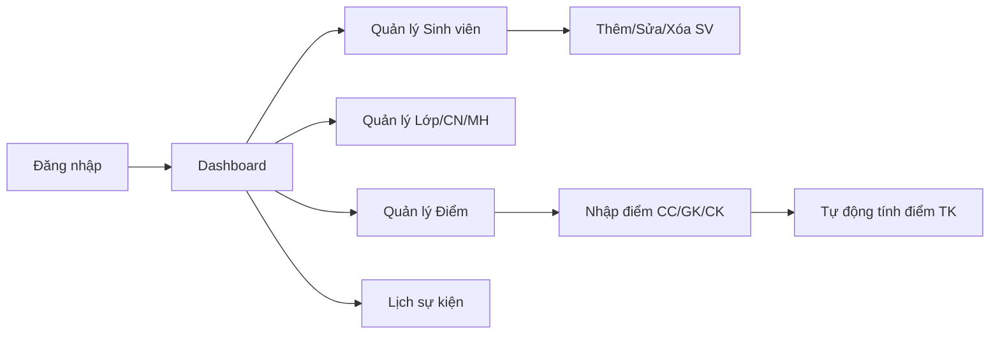

# 📚 QLDIEM - Hệ Thống Quản Lý Sinh Viên

<div align="center">


*Ứng dụng Android quản lý sinh viên toàn diện với hệ thống phân quyền và quản lý điểm chi tiết*

[Tính năng](#-tính-năng) •
[Demo](#-demo) •
[Cài đặt](#-cài-đặt) •
[Sử dụng](#-sử-dụng) •
[Đóng góp](#-đóng-góp)

</div>

---

## 📖 Tổng quan

**QLDIEM** là ứng dụng quản lý sinh viên hoàn chỉnh được xây dựng trên nền tảng Android với Java. Ứng dụng cung cấp giải pháp toàn diện cho việc quản lý thông tin sinh viên, lớp học, môn học và điểm số trong môi trường giáo dục.

### ✨ Điểm nổi bật

- 🔐 **Bảo mật cao** - Mã hóa mật khẩu SHA-256, session management
- 👥 **Phân quyền rõ ràng** - 3 cấp độ người dùng (Admin, Lecturer, Student)
- 📊 **Quản lý điểm chi tiết** - Hệ thống điểm 3 thành phần (CC, GK, CK) với tự động tính tổng kết
- 🎨 **Giao diện thân thiện** - Material Design, responsive UI
- 💾 **Lưu trữ offline** - SQLite database, không cần internet
- 📅 **Quản lý sự kiện** - Lịch sự kiện tích hợp

---

## 🎯 Tính năng

### 🔑 Xác thực & Phân quyền
- ✅ Đăng nhập/Đăng ký với validation
- ✅ Mã hóa mật khẩu SHA-256
- ✅ Session management
- ✅ 3 cấp độ phân quyền: Admin, Lecturer, Student

### 👨‍🎓 Quản lý Sinh viên
- ✅ CRUD operations (Thêm, Sửa, Xóa, Xem)
- ✅ Upload ảnh đại diện (Base64 encoding)
- ✅ Tìm kiếm theo mã SV, tên, email
- ✅ Liên kết với lớp và chuyên ngành

### 📚 Quản lý Học vụ
- ✅ **Lớp học** - Quản lý danh sách lớp
- ✅ **Chuyên ngành** - Quản lý các chuyên ngành đào tạo
- ✅ **Môn học** - Quản lý danh mục môn học

### 📊 Quản lý Điểm
- ✅ **Hệ thống điểm 3 thành phần:**
  - Điểm Chuyên cần (10%)
  - Điểm Giữa kỳ (30%)
  - Điểm Cuối kỳ (60%)
- ✅ Tự động tính điểm tổng kết
- ✅ Quy đổi hệ điểm 4 và hệ chữ (A+, A, B+, B, C+, C, D+, D, F)
- ✅ Quản lý theo học kỳ và năm học
- ✅ Validation điểm (0-10)

### 📅 Lịch Sự kiện
- ✅ Thêm/Sửa/Xóa sự kiện
- ✅ DatePicker integration
- ✅ Hiển thị theo thứ tự thời gian

---

## 🏗️ Kiến trúc

### 📁 Cấu trúc thư mục

```
app/src/main/
├── java/com/example/qldiem/
│   ├── activities/              # Activity layers
│   │   ├── LoginActivity.java
│   │   ├── RegisterActivity.java
│   │   ├── MainActivity.java
│   │   ├── SinhVienActivity.java
│   │   ├── AddEditSinhVienActivity.java
│   │   ├── LopActivity.java
│   │   ├── ChuyenNganhActivity.java
│   │   ├── MonHocActivity.java
│   │   ├── DiemActivity.java
│   │   ├── EventActivity.java
│   │   ├── TaiKhoanActivity.java
│   │   └── ProfileActivity.java
│   │
│   ├── adapters/                # RecyclerView Adapters
│   │   ├── SinhVienAdapter.java
│   │   ├── LopAdapter.java
│   │   ├── ChuyenNganhAdapter.java
│   │   ├── MonHocAdapter.java
│   │   ├── DiemAdapter.java
│   │   └── EventAdapter.java
│   │
│   ├── models/                  # Data Models
│   │   ├── SinhVien.java
│   │   ├── Lop.java
│   │   ├── ChuyenNganh.java
│   │   ├── MonHoc.java
│   │   ├── TaiKhoan.java
│   │   ├── Diem.java
│   │   └── EventCalendar.java
│   │
│   ├── database/                # Database Layer
│   │   └── DatabaseHelper.java
│   │
│   └── utils/                   # Utilities
│       ├── SecurityUtils.java
│       ├── ValidationUtils.java
│       ├── SessionManager.java
│       └── ImageUtils.java
│
└── res/
    ├── layout/                  # 28 XML layouts
    ├── drawable/                # Icons & images
    ├── values/                  # Strings, colors, themes
    └── menu/                    # Menu resources
```

### 🗄️ Database Schema (SQLite)

Hệ thống sử dụng **7 bảng chính** để quản lý dữ liệu:

| Bảng | Mô tả | Khóa chính | Ràng buộc |
|------|-------|------------|-----------|
| **LOP** | Quản lý lớp học | `id` | `maLop` UNIQUE |
| **CHUYENNGANH** | Chuyên ngành đào tạo | `id` | `maChuyenNganh` UNIQUE |
| **MONHOC** | Danh mục môn học | `id` | `maMH` UNIQUE |
| **SINHVIEN** | Thông tin sinh viên | `id` | `maSv` UNIQUE, FK to LOP, CHUYENNGANH |
| **taiKhoan** | Tài khoản người dùng | `id` | `tenTaiKhoan` UNIQUE |
| **DIEM** | Điểm số sinh viên | `id` | UNIQUE(`maSv`, `maMH`) |
| **EventCalendar** | Lịch sự kiện | `id` | - |

<details>
<summary><b>📋 Chi tiết Schema</b></summary>

```sql
-- Bảng Lớp học
CREATE TABLE LOP (
    id INTEGER PRIMARY KEY AUTOINCREMENT,
    maLop TEXT UNIQUE NOT NULL,
    tenLop TEXT NOT NULL
);

-- Bảng Chuyên ngành
CREATE TABLE CHUYENNGANH (
    id INTEGER PRIMARY KEY AUTOINCREMENT,
    maChuyenNganh TEXT UNIQUE NOT NULL,
    tenChuyenNganh TEXT NOT NULL
);

-- Bảng Môn học
CREATE TABLE MONHOC (
    id INTEGER PRIMARY KEY AUTOINCREMENT,
    maMH TEXT UNIQUE NOT NULL,
    tenmonhoc TEXT NOT NULL
);

-- Bảng Sinh viên
CREATE TABLE SINHVIEN (
    id INTEGER PRIMARY KEY AUTOINCREMENT,
    maSv TEXT UNIQUE NOT NULL,
    tenSV TEXT NOT NULL,
    email TEXT,
    hinh TEXT,  -- Base64 encoded image
    maLop TEXT,
    maChuyenNganh TEXT,
    FOREIGN KEY (maLop) REFERENCES LOP(maLop),
    FOREIGN KEY (maChuyenNganh) REFERENCES CHUYENNGANH(maChuyenNganh)
);

-- Bảng Tài khoản
CREATE TABLE taiKhoan (
    id INTEGER PRIMARY KEY AUTOINCREMENT,
    tenTaiKhoan TEXT UNIQUE NOT NULL,
    matKhau TEXT NOT NULL,  -- SHA-256 hashed
    vaiTro TEXT NOT NULL,   -- Admin/Lecturer/Student
    hoTen TEXT NOT NULL
);

-- Bảng Điểm
CREATE TABLE DIEM (
    id INTEGER PRIMARY KEY AUTOINCREMENT,
    maSv TEXT NOT NULL,
    maMH TEXT NOT NULL,
    diemChuyenCan REAL DEFAULT 0,
    diemGiuaKy REAL DEFAULT 0,
    diemCuoiKy REAL DEFAULT 0,
    hocKy INTEGER,
    namHoc TEXT,
    UNIQUE(maSv, maMH, hocKy, namHoc),
    FOREIGN KEY (maSv) REFERENCES SINHVIEN(maSv),
    FOREIGN KEY (maMH) REFERENCES MONHOC(maMH)
);

-- Bảng Sự kiện
CREATE TABLE EventCalendar (
    id INTEGER PRIMARY KEY AUTOINCREMENT,
    Date TEXT NOT NULL,  -- yyyy-MM-dd format
    Event TEXT NOT NULL
);
```

</details>

---

## 📊 Phân quyền người dùng

| Vai trò | Quyền hạn |
|---------|-----------|
| **👑 Admin** | • Toàn quyền truy cập<br>• Quản lý lớp, chuyên ngành<br>• Quản lý sinh viên<br>• Quản lý môn học và điểm<br>• Quản lý tài khoản<br>• Xem lịch sự kiện |
| **👨‍🏫 Lecturer** | • Quản lý sinh viên<br>• Quản lý môn học<br>• Nhập/sửa điểm<br>• Xem lịch sự kiện<br>• Không thể quản lý lớp/chuyên ngành |
| **👨‍🎓 Student** | • Xem điểm cá nhân<br>• Xem lịch sự kiện<br>• Chỉ đọc (Read-only)<br>• Không có quyền chỉnh sửa |

### 🔐 Tài khoản mặc định

```
Username: admin
Password: admin123
Role: Admin
```

---

## 🚀 Cài đặt

### Yêu cầu hệ thống

- **Android Studio**: Arctic Fox (2020.3.1) trở lên
- **JDK**: 11 hoặc mới hơn
- **Android SDK**: API Level 24+ (Android 7.0 Nougat)
- **Gradle**: 8.0+
- **Build Tools**: 34.0.0

### Các bước cài đặt

#### 1️⃣ Clone repository

```bash
git clone https://github.com/yourusername/QLDIEM.git
cd QLDIEM
```

#### 2️⃣ Mở project trong Android Studio

```bash
# Mở Android Studio
File > Open > Chọn thư mục QLDIEM
```

#### 3️⃣ Sync Gradle

Android Studio sẽ tự động sync. Nếu không, chạy:

```bash
./gradlew build --refresh-dependencies
```

#### 4️⃣ Kiểm tra dependencies (app/build.gradle.kts)

```kotlin
dependencies {
    implementation("androidx.appcompat:appcompat:1.6.1")
    implementation("com.google.android.material:material:1.11.0")
    implementation("androidx.constraintlayout:constraintlayout:2.1.4")
    implementation("androidx.recyclerview:recyclerview:1.3.2")
    implementation("androidx.cardview:cardview:1.0.0")
    
    testImplementation("junit:junit:4.13.2")
    androidTestImplementation("androidx.test.ext:junit:1.1.5")
    androidTestImplementation("androidx.test.espresso:espresso-core:3.5.1")
}
```

#### 5️⃣ Cấu hình permissions trong AndroidManifest.xml

```xml
<uses-permission android:name="android.permission.READ_EXTERNAL_STORAGE" />
<uses-permission android:name="android.permission.READ_MEDIA_IMAGES" />
```

#### 6️⃣ Build và Run

```bash
# Build project
./gradlew assembleDebug

# Hoặc nhấn Run trong Android Studio (Shift + F10)
```

---

## 💻 Sử dụng

### Đăng nhập lần đầu

1. Khởi động ứng dụng
2. Sử dụng tài khoản mặc định:
   - **Username**: `admin`
   - **Password**: `admin123`
3. Hoặc đăng ký tài khoản mới

### Workflow cơ bản



### Screenshots

<details>
<summary><b>🖼️ Xem ảnh demo</b></summary>

> **Lưu ý**: Thêm screenshots vào thư mục `/screenshots` và cập nhật đường dẫn

```
screenshots/
├── login.png
├── dashboard.png
├── student_list.png
├── student_detail.png
├── grade_management.png
└── calendar.png
```

</details>

---

## 🛠️ Tech Stack

| Component | Technology |
|-----------|-----------|
| **Language** | Java |
| **UI Framework** | Android SDK, Material Design |
| **Database** | SQLite |
| **Architecture** | MVC Pattern |
| **Image Handling** | Base64 Encoding |
| **Security** | SHA-256 Hashing |
| **Build Tool** | Gradle (Kotlin DSL) |

---

## 📝 API & Modules

### Core Utilities

#### SecurityUtils.java
```java
// Mã hóa mật khẩu
public static String hashPassword(String password)
public static boolean verifyPassword(String password, String hash)
```

#### ValidationUtils.java
```java
// Validation dữ liệu
public static boolean isValidEmail(String email)
public static boolean isValidGrade(double grade)
public static boolean isNotEmpty(String text)
```

#### SessionManager.java
```java
// Quản lý phiên đăng nhập
public void createLoginSession(String username, String role)
public boolean isLoggedIn()
public void logout()
```

#### ImageUtils.java
```java
// Xử lý ảnh
public static String encodeToBase64(Bitmap image)
public static Bitmap decodeFromBase64(String encodedImage)
```

---

## 🔍 Troubleshooting

<details>
<summary><b>❌ Cannot resolve symbol 'R'</b></summary>

```bash
# Giải pháp 1: Clean & Rebuild
Build > Clean Project
Build > Rebuild Project

# Giải pháp 2: Invalidate Caches
File > Invalidate Caches / Restart
```

</details>

<details>
<summary><b>❌ Database errors</b></summary>

```bash
# Xóa dữ liệu ứng dụng
Settings > Apps > QLDIEM > Storage > Clear Data

# Hoặc uninstall và cài lại
```

</details>

<details>
<summary><b>❌ Permission denied (READ_EXTERNAL_STORAGE)</b></summary>

```java
// Thêm runtime permission request cho Android 6.0+
if (Build.VERSION.SDK_INT >= Build.VERSION_CODES.M) {
    requestPermissions(new String[]{
        Manifest.permission.READ_EXTERNAL_STORAGE
    }, REQUEST_CODE);
}
```

</details>

<details>
<summary><b>❌ Gradle sync failed</b></summary>

```bash
# Xóa cache Gradle
rm -rf ~/.gradle/caches/
./gradlew clean build --refresh-dependencies
```

</details>

---

## 🤝 Đóng góp

Chúng tôi hoan nghênh mọi đóng góp! 

### Quy trình đóng góp

1. **Fork** repository này
2. **Tạo branch** cho feature mới (`git checkout -b feature/AmazingFeature`)
3. **Commit** thay đổi (`git commit -m 'Add some AmazingFeature'`)
4. **Push** lên branch (`git push origin feature/AmazingFeature`)
5. **Tạo Pull Request**

### Coding Guidelines

- Tuân thủ [Java Code Conventions](https://www.oracle.com/java/technologies/javase/codeconventions-contents.html)
- Comment code rõ ràng (Tiếng Việt hoặc Tiếng Anh)
- Viết commit message có ý nghĩa
- Test kỹ trước khi tạo PR

---

## 🗺️ Roadmap

- [ ] **v2.0**: Tích hợp Firebase/Cloud Database
- [ ] **v2.1**: Export/Import dữ liệu (CSV, Excel)
- [ ] **v2.2**: Thống kê và biểu đồ (Charts)
- [ ] **v2.3**: Dark Mode
- [ ] **v2.4**: Multi-language (English support)
- [ ] **v2.5**: Push Notifications
- [ ] **v2.6**: Backup/Restore tự động
- [ ] **v3.0**: Migrate sang Kotlin + MVVM

---

## 📄 License

```
MIT License

Copyright (c) 2024 QLDIEM

Permission is hereby granted, free of charge, to any person obtaining a copy
of this software and associated documentation files (the "Software"), to deal
in the Software without restriction, including without limitation the rights
to use, copy, modify, merge, publish, distribute, sublicense, and/or sell
copies of the Software, and to permit persons to whom the Software is
furnished to do so, subject to the following conditions:

The above copyright notice and this permission notice shall be included in all
copies or substantial portions of the Software.

THE SOFTWARE IS PROVIDED "AS IS", WITHOUT WARRANTY OF ANY KIND, EXPRESS OR
IMPLIED, INCLUDING BUT NOT LIMITED TO THE WARRANTIES OF MERCHANTABILITY,
FITNESS FOR A PARTICULAR PURPOSE AND NONINFRINGEMENT. IN NO EVENT SHALL THE
AUTHORS OR COPYRIGHT HOLDERS BE LIABLE FOR ANY CLAIM, DAMAGES OR OTHER
LIABILITY, WHETHER IN AN ACTION OF CONTRACT, TORT OR OTHERWISE, ARISING FROM,
OUT OF OR IN CONNECTION WITH THE SOFTWARE OR THE USE OR OTHER DEALINGS IN THE
SOFTWARE.
```

---

## 👥 Tác giả

**Android Student Management System**

- 📧 Email: your.email@example.com
- 🔗 GitHub: [@yourusername](https://github.com/yourusername)
- 🌐 Website: [your-website.com](https://your-website.com)

---

## 🙏 Acknowledgments

- [Material Design Icons](https://material.io/resources/icons/)
- [Android Developer Documentation](https://developer.android.com/)
- [Stack Overflow Community](https://stackoverflow.com/)

---

## 📞 Hỗ trợ

Nếu gặp vấn đề hoặc có câu hỏi:

1. 📖 Đọc [Documentation](#)
2. 🔍 Tìm trong [Issues](https://github.com/yourusername/QLDIEM/issues)
3. 💬 Tạo [New Issue](https://github.com/yourusername/QLDIEM/issues/new)
4. 📧 Email trực tiếp cho tác giả

---

<div align="center">

**⭐ Nếu project hữu ích, hãy cho một Star nhé! ⭐**

Made with ❤️ by [Your Name]

[⬆ Về đầu trang](#-qldiem---hệ-thống-quản-lý-sinh-viên)

</div>
